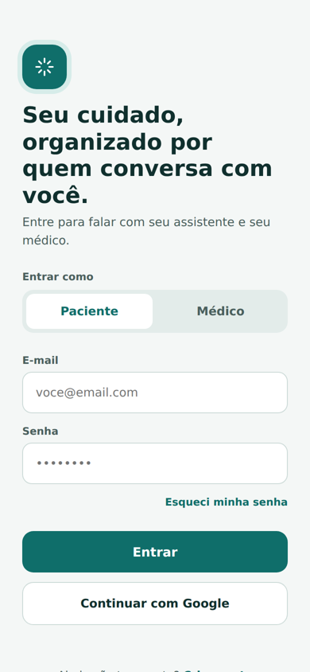
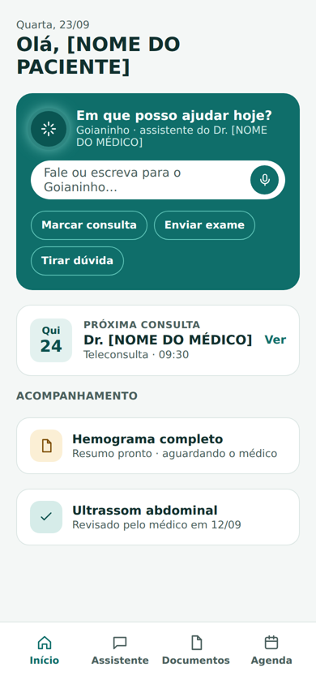
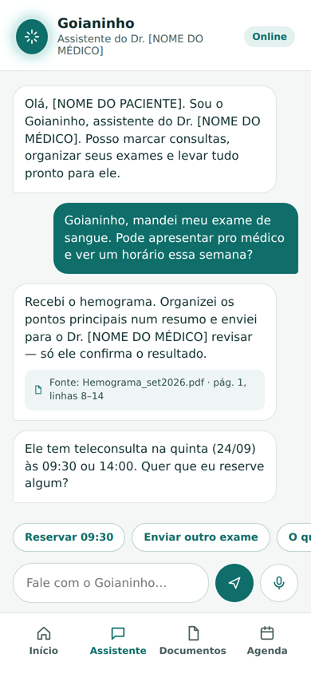
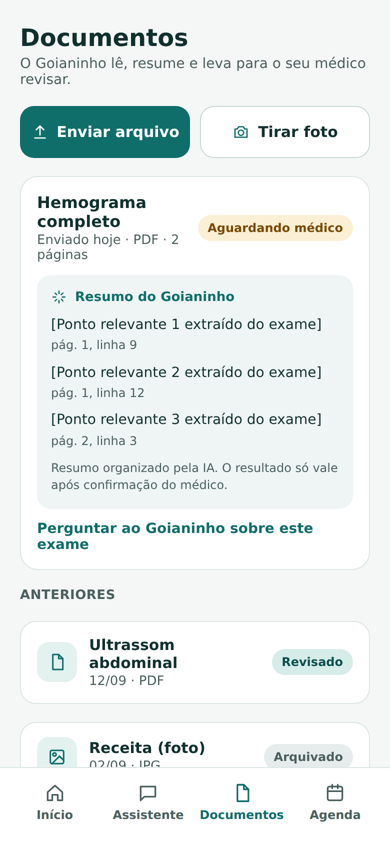
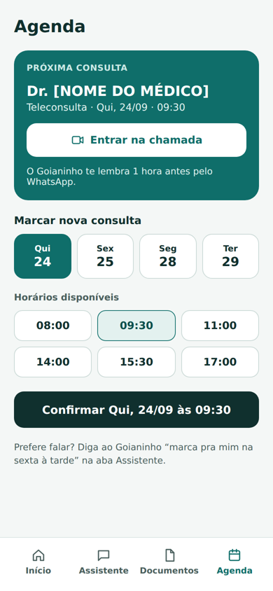
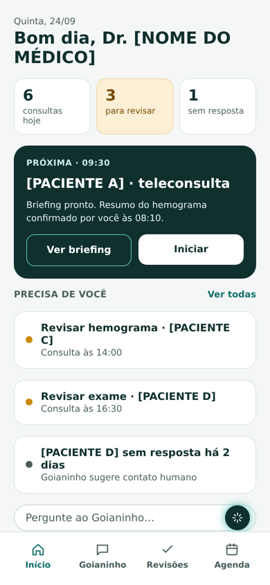
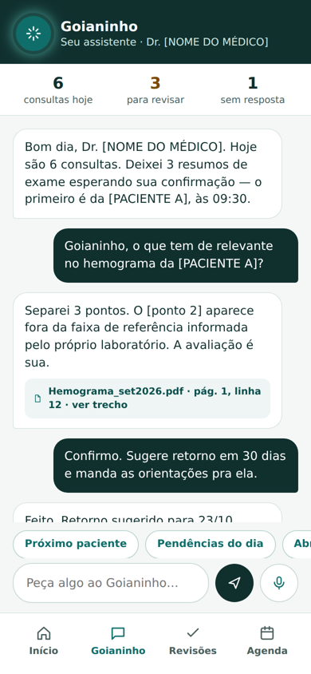
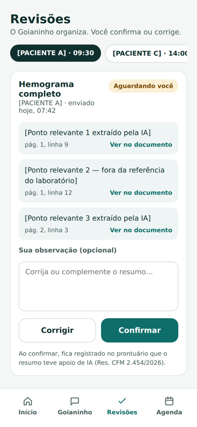
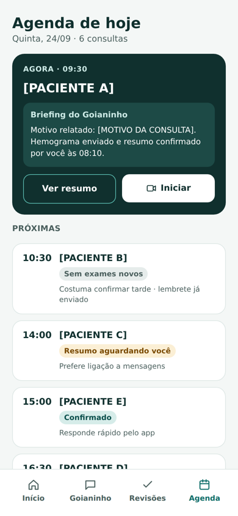

# Goianinho Medicina

**Um app Android que conecta paciente e médico por meio de um assistente de IA, o Goianinho, que organiza exames, agenda consultas e prepara tudo para o médico decidir.**


> Trabalho de Conclusão de Curso — Engenharia de Software, Centro Universitário Alfredo Nasser (UNIFAN).

---

## Sobre o projeto

Entre o paciente precisar de atendimento e o médico atender bem existe um processo fragmentado: fila, exames que chegam desorganizados, agendamento manual e o médico perdendo tempo juntando informação.

O **Goianinho** é um assistente conversacional que acompanha os dois lados:

- **O paciente** fala em linguagem natural ("marca minha consulta", "manda meu exame pro médico") e o Goianinho executa.
- **O médico** recebe resumos prontos, com a **fonte de cada informação** (arquivo, página e linha), e só confirma ou corrige.

O mercado já tem peças soltas (triagem, agendamento, escriba de consulta). Aqui elas ficam juntas numa única conversa contínua, para paciente e médico.

### Princípios

| | Princípio |
|---|---|
| 🩺 | **A IA apoia, o médico decide.** O Goianinho nunca apresenta diagnóstico. Todo resumo fica "aguardando médico" até a confirmação. |
| 🔎 | **Toda informação tem fonte.** Cada ponto de um resumo mostra de onde saiu. |
| 💬 | **Linguagem natural primeiro.** Tudo pode ser feito conversando; botões são atalhos. |
| 🤝 | **Simples para quem não é da tecnologia.** Textos curtos, botões grandes e opção de voz. |

Esses princípios seguem a Resolução CFM nº 2.454/2026, que regulamenta o uso de IA na medicina no Brasil.

---

## Telas

### Visão do paciente

| Login | Início | Chat com o Goianinho | Documentos | Agenda |
|:---:|:---:|:---:|:---:|:---:|
|  |  |  |  |  |

### Visão do médico

| Início | Goianinho do médico | Revisão de resumos | Agenda do dia |
|:---:|:---:|:---:|:---:|
|  |  |  |  |

> As imagens são do protótipo. Os nomes entre colchetes, como `[NOME DO MÉDICO]`, são marcadores de exemplo.

---

## Tecnologias

| Camada | Tecnologia |
|---|---|
| Linguagem | Kotlin |
| Interface | Jetpack Compose + Material 3 |
| Arquitetura | MVVM (Screen + ViewModel + StateFlow + Repository) |
| Navegação | Navigation Compose |
| Login | Firebase Authentication (e-mail e senha) |
| Banco de dados | Cloud Firestore |
| IDE | IntelliJ IDEA com plugin Android |
| IA | Simulada nesta fase (respostas fixas), pronta para ser trocada por uma IA real |

---

## Arquitetura

O projeto segue o MVVM recomendado pelo Google ([Guide to app architecture](https://developer.android.com/topic/architecture)):

```
Tela (Screen)  ──evento──▶  ViewModel  ──▶  Repository  ──▶  Firebase
     ▲                          │
     └────── estado (StateFlow) ┘
```

- **Tela:** só desenha e repassa cliques.
- **ViewModel:** guarda o estado e decide o que fazer.
- **Repository:** é o único que fala com o Firebase.

### Estrutura de pastas

```
app/src/main/java/com/goianinho/medicina/
 ├── ui/
 │    ├── login/        Módulo 1 — Login e cadastro
 │    ├── home/         Módulo 1 — Início do paciente e do médico
 │    ├── chat/         Módulo 2 — Chat com o Goianinho
 │    ├── documentos/   Módulo 3 — Documentos e revisão
 │    ├── agenda/       Módulo 4 — Agenda e chamada
 │    ├── comum/        Componentes compartilhados
 │    └── theme/        Cores e tipografia
 ├── data/
 │    ├── model/        Classes de dados (Firestore)
 │    └── repository/   Acesso ao Firebase
 └── navigation/        Rotas do app
```

Cada pasta de módulo tem um **`doc.md`** com as telas, os requisitos, o código de referência e as aulas do Google para aquele módulo.

---

## Como rodar

**Pré-requisitos**

- IntelliJ IDEA com o plugin **Android** ativado
- **Android SDK** instalado (API 36)
- **JDK 21**
- Celular Android com depuração USB ativada, ou um emulador

**Passos**

```bash
git clone https://github.com/Dhyegoreis/projeto_app.git
cd projeto_app
```

1. Abra a pasta no IntelliJ IDEA e espere a sincronização do Gradle terminar.
2. Conecte o celular (ou inicie um emulador).
3. Clique em **Run ▶**.

O arquivo `google-services.json` já está no repositório (privado), então o app conecta ao Firebase do projeto sem configuração extra.

---

## Equipe

| Módulo | Responsável | Branch | Visão do paciente | Visão do médico |
|---|---|---|---|---|
| 1 · Login e Início | [INTEGRANTE 1] | `feature/login` | Login e Início | Início |
| 2 · Chat com o Goianinho | [INTEGRANTE 2] | `feature/chat-ia` | Chat | Goianinho do médico |
| 3 · Documentos | [INTEGRANTE 3] | `feature/documentos` | Documentos | Revisão de resumos |
| 4 · Agenda | [INTEGRANTE 4] | `feature/agenda` | Agenda | Agenda do dia |

**Líder do projeto e arquitetura:** Dhyego Ferreira dos Reis
**Orientação:** [NOME DO ORIENTADOR]

### Como o time trabalha

- Cada integrante trabalha **somente na sua branch**.
- A `main` é alterada **apenas pelo líder**, por meio de Pull Request revisado e aprovado.
- Commits seguem o padrão `feat(modulo): descrição` ou `fix(modulo): descrição`.

---

## Roadmap

- [x] Protótipo das 9 telas
- [x] Documentação do projeto e dos módulos
- [x] Fundação: Firebase, tema, modelos de dados e navegação
- [ ] Telas visuais de cada módulo
- [ ] Integração com Firebase (Auth e Firestore)
- [ ] Navegação ponta a ponta e testes entre módulos
- [ ] Ajustes finais e demonstração

**Próximas fases (fora do escopo atual):** IA real respondendo no chat, leitura real de exames, videochamada, canal WhatsApp e upload de arquivos.

---

## Aviso

Projeto acadêmico, em desenvolvimento. O app **não emite diagnóstico** nem substitui a avaliação de um profissional de saúde. Os dados exibidos nas telas são fictícios.

---

*Projeto elaborado e arquitetado por **Dhyego Ferreira dos Reis**.*
